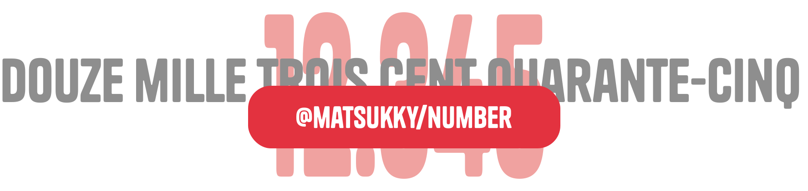

<div align="center">
    <h1 style="border-bottom: none">
        
        <h1>Number</h1>
        <p>Lightweight, dependency-free library for converting numbers to words in multiple languages</p>
        <h4>English - French (Belgian available) - Spanish - Italian - German - Japanese - Chinese - Arabic - Russian - (And a custom)</h4>
    </h1>
</div>

A minimalist library that converts numbers to their word representation in various languages. Zero dependencies, tree-shakeable, and type-safe.

## Table of Contents

- [Installation](#installation)
- [Features](#features)
- [Usage](#usage)
  - [Basic Usage](#basic-usage)
  - [Localization](#localization)
  - [Capitalization](#capitalization)

## Installation

```bash
npm install @matsukky/number
# or
yarn add @matsukky/number
# or
bun add @matsukky/number
```

## Features

- 🪶 Lightweight
- 📦 Zero dependencies
- 🌍 Support for multiple languages
- 🔠 Automatic capitalization
- 💪 Fully typed (TypeScript)

## Usage

### Basic Usage

```typescript
import convertNumberToWords from '@matsukky/number';

console.log(convertNumberToWords(42));    // "forty-two"
console.log(convertNumberToWords(100));   // "one hundred"
console.log(convertNumberToWords(1337));  // "one thousand three hundred thirty-seven"
console.log(convertNumberToWords(-42));   // "minus forty-two"
```

### Localization

```typescript
import { locale, convertNumberToWords } from '@matsukky/number';

// Load French locale
await locale('fr', true); // if the languages 

console.log(convertNumberToWords(42));    // "quarante-deux"
console.log(convertNumberToWords(100));   // "cent"


// OR
import { locale, convertNumberToWords } from '@matsukky/number';
import '@matsukky/number/locale/es'

locale('es')

console.log(convertNumberToWords(42));    // "cuarenta-dos"
console.log(convertNumberToWords(100));   // "cien"
```

#### Custom Language
You can use your own language by using the code ``custom``.

```typescript
import { locale, convertNumberToWords, Types } from '@matsukky/number';

const CustomLang = {
  code: 'custom',
  ones: ["", "uno", "dyo", "tri", "quatro", "penta", "hexa", "septa", "okto", "nova"],
  teens: ["dizan", "dizan-uno", "dizan-dyo", "dizan-tri", "dizan-quatro", "dizan-penta", "dizan-hexa", "dizan-septa", "dizan-okto", "dizan-nova"],
  tens: ["", "", "dizo", "trizo", "quarzo", "pentzo", "hexzo", "septzo", "okzo", "novzo"],
  thousands: ["", "kilo", "mega", "giga"],
  hundred: "hundo",
  zero: "nullo",
  minus: "meno",
} as Types.LanguageData;

locale(CustomLang, true)

console.log(convertNumberToWords(42));    // "quarzo-dyo"
console.log(convertNumberToWords(100));   // "hundo"
```

### Capitalization

```typescript
import convertNumberToWords from '@matsukky/number';

console.log(convertNumberToWords(42, { capitalize: true }));    // "Forty-two"
console.log(convertNumberToWords(100, { capitalize: true }));   // "One hundred"
```

## API Reference

### convertNumberToWords(number, options)

```typescript
convertNumberToWords(
  num: number, 
  options?: {
    capitalize?: boolean;
    language?: AvalaibleLanguage;
  }
): string
```

### LoadedLanguages()

```typescript
LoadedLanguages(): string[]
```

### locale(language, dynamicImport?)

```typescript
locale(
  language: AvalaibleLanguage | LanguageData, 
  dynamicImport?: boolean
): Promise<void>
```

## Supported Languages

- English (en)
- French (fr)
- Belgian French (fr-BE)
- Spanish (es)
- Italian (it)
- German (de)
- Japanese (ja)
- Chinese (zh)
- Arabic (ar)
- Russian (ru)

Each language implementation includes:
- Basic numbers (0-9)
- Teens (11-19)
- Tens (20, 30, etc.)
- Hundreds
- Powers of thousands (thousand, million, billion, etc.)
- Negative numbers support